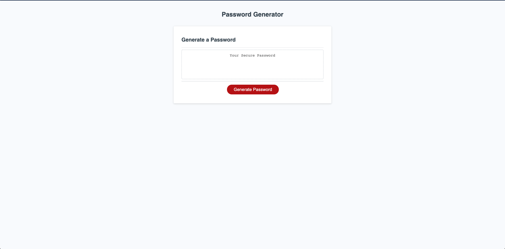

# password-generator

In my latest development, I have created an application that an employee or anyone for that matter to use and generate a random password based on criteria they have selected to provide greater security. This app runs in the browser, and will feature dynamically updated HTML and CSS powered by JavaScript code that I wrote. It has a clean and polished user interface that is responsive, ensuring that it adapts to multiple screen sizes.

## Installation of Repo

Follow these steps to view my project!

1. Open link in github. - https://github.com/xdanielmtz/password-generator
2. Clone with SSH
3. Run "git clone" command in Terminal with the pasted link
4. Run "code ." command to open in VS Code.
5. Enjoy.

## What will you find in this repo?

- An index.html (The web application itself)
- CSS sheet 
- Javascript page
- A great readme ;)

## Upon opening the web application, you will notice: 

A button that activates a series of prompts that allows you to choose your desired password criteria.

You can only select a minimum of 8 characters and max of 128 characters. If you go over or below the requirements you will be notified appropriately. 

A selection of character type. Character types include: lowercase, uppercase, numeric, and or special characters.

The generated password will appear on screen when finish with selected prompts.

## Deployed Site Link:

(Password Generator) https://xdanielmtz.github.io/password-generator/

## Sneak Peak:

